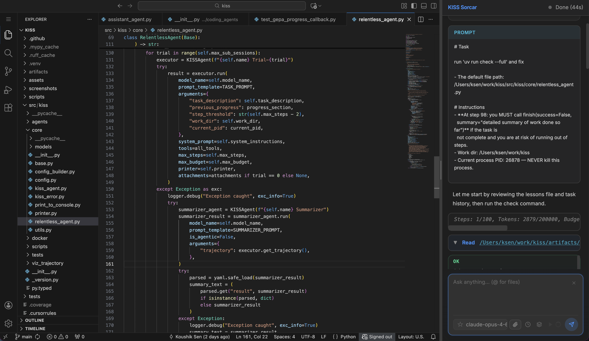

<div align="center">


# When Simplicity Becomes Your Superpower: Meet KISS Multi-Agent Multi-Optimization Framework

[](https://pypi.org/project/kiss-agent-framework/)
[](LICENSE)
[](https://www.python.org/)

*"Everything should be made as simple as possible, but not simpler." — Albert Einstein*

</div>

______________________________________________________________________

KISS stands for ["Keep it Simple, Stupid"](https://en.wikipedia.org/wiki/KISS_principle) which is a well-known software engineering principle.

<details>
<summary><strong>Table of Contents</strong></summary>

- [Installation and Launching KISS Sorcar](#installation-and-launching-kiss-sorcar)
- [Introduction to KISS Sorcar](#introduction-to-kiss-sorcar)
- [The Problem with AI Agent Frameworks Today](#-the-problem-with-ai-agent-frameworks-today)
- [Your First Agent in 30 Seconds](#-your-first-agent-in-30-seconds)
- [Multi-Agent Orchestration](#-multi-agent-orchestration-is-function-composition)
- [Key Features and Principles](#-key-features-and-principles-behind-kiss-and-sorcar)
- [KISSAgent API Reference](#-kissagent-api-reference)
- [GEPA Prompt Optimization](#-using-gepa-for-prompt-optimization)
- [KISSEvolve Algorithm Discovery](#-using-kissevolve-for-algorithm-discovery)
- [Models Supported](#-models-supported)
- [Contributing](#-contributing)
- [License](#-license)
- [Authors](#%EF%B8%8F-authors)

</details>

# Introduction to KISS Sorcar



**KISS Sorcar** (named after the [famous Bengali magician P.C. Sorcar](https://en.wikipedia.org/wiki/P._C._Sorcar)) is a free alternative to Cursor IDE and **a general-purpose agent with web browsing and native desktop app execution capabilities**. It runs **locally** as a VS Code extension. It **codes really well** and **works pretty fast**. The agent can **run relentlessly for hours to days**. It is **embedded in a browser** and uses **full-fledged VS Code**. It has **full browser** support and limited **multimodal** support. The good part is that KISS Sorcar is **completely free** and **open-source** with **no monthly subscription fees**. Note that I am developing KISS Sorcar using KISS Sorcar so that I can improve the power and capabilities of KISS Sorcar. KISS Sorcar has been built on top of the KISS Multi Agentic Framework, which I describe in the next section. A video on KISS Sorcar is available at [https://www.youtube.com/watch?v=xnYxWvRqACE](https://www.youtube.com/watch?v=xnYxWvRqACE).

#whatispossible #KISSSorcar

## Install and Launch KISS Sorcar

To Install KISS Sorcar, open Visual Studio Code, search for "KISS Sorcar" in the extension marketplace, install, and relaunch. You can also manually download the extension from [src/kiss/agents/vscode/kiss-sorcar.vsix](src/kiss/agents/vscode/kiss-sorcar.vsix).

Open a terminal and use sorcar as a normal shell command. Some examples are:

```
sorcar -t "What is 2435*234"

sorcar -n -t "What is 2435*234?" # to start in a new chat session in sorcar use -n

sorcar -m "claude-sonnet-4-6" -t "What is 2435*234?" # to use a specific model

echo "Can you find the cheapest non-stop flight from SFO to JFK on June 15 by consulting various websites?" > prompt
sorcar -f prompt. # use contents of a file to send task

sorcar -t 'Can you send the message "Hello from Sorcar!" to ksen via the desktop slack app?' 

sorcar -t 'Can you write a thorough and precise plan in PLAN.md to simplify the project code?'
sorcar -t 'I see some issues and bugs in PLAN.md.  Can you fix them?'  # lie to the agent to force improve the plan
```

# Introduction to KISS

## 🎯 The Problem with AI Agent Frameworks Today

The AI agent ecosystem has grown increasingly complex. Many frameworks introduce excessive layers of abstraction and unnecessary techniques, resulting in a steep learning curve that can significantly hinder developer productivity from the outset.

**What if there was another way?**

What if building AI agents could be as straightforward as the name suggests?

Enter **KISS** — the *Keep It Simple, Stupid* Agent Framework.

## 🚀 Your First Agent in 30 Seconds

Let me show you something beautiful:

```python
from kiss.core.kiss_agent import KISSAgent

def calculate(expression: str) -> str:
    """Evaluate a math expression."""
    return str(eval(expression))

agent = KISSAgent(name="Math Buddy")
result = agent.run(
    model_name="gemini-2.5-flash",
    prompt_template="Calculate: {question}",
    arguments={"question": "What is 15% of 847?"},
    tools=[calculate]
)
print(result)  # 127.05
```

That's a fully functional AI agent that uses tools. No annotations. No boilerplate. No ceremony. Just intent, directly expressed.
Well, you might ask "**Why not use LangChain, DSpy, OpenHands, MiniSweAgent, CrewAI, Google ADK, Claude Agent SDK, or some well-established agent frameworks?**" Here is my response:

- KISS comes with KISS Sorcar, a powerful local code IDE that is free and open-source.
- It has the GEPA prompt optimizer built-in with a simple API.
- It has a [`RelentlessAgent`](src/kiss/core/relentless_agent.py), which is pretty straightforward in terms of implementation, but it can work for very long tasks. It was self-evolved over time to reduce cost and running time.
- No bloat and simple codebase.
- New techniques will be incorporated to the framework as we research them.

## 🤝 Multi-Agent Orchestration is Function Composition

Here's where KISS really shines — composing multiple agents into systems greater than the sum of their parts.

Since agents are just functions, you orchestrate them with plain Python. Here's a complete **research-to-article pipeline** with three agents:

```python
from kiss.core.kiss_agent import KISSAgent

# Agent 1: Research a topic
researcher = KISSAgent(name="Researcher")
research = researcher.run(
    model_name="gpt-4o",
    prompt_template="List 3 key facts about {topic}. Be concise.",
    arguments={"topic": "Python asyncio"},
    is_agentic=False  # Simple generation, no tools
)

# Agent 2: Write a draft using the research
writer = KISSAgent(name="Writer")
draft = writer.run(
    model_name="claude-sonnet-4-5",
    prompt_template="Write a 2-paragraph intro based on:\n{research}",
    arguments={"research": research},
    is_agentic=False
)

# Agent 3: Polish the draft
editor = KISSAgent(name="Editor")
final = editor.run(
    model_name="gemini-2.5-flash",
    prompt_template="Improve clarity and fix any errors:\n{draft}",
    arguments={"draft": draft},
    is_agentic=False
)

print(final)
```

**That's it.** Each agent can use a different model. Each agent saves its own trajectory. And you compose them with the most powerful orchestration tool ever invented: **regular Python code**.

No special orchestration framework needed. No message buses. No complex state machines. Just Python functions calling Python functions.

## 💡 Key Features and Principles behind KISS and Sorcar

### Key Features

- **KISSAgent with ReAct Loop**: The core agent runs a generate-execute-observe loop with native function calling, automatic tool schema generation from Python function signatures and docstrings, trajectory saving, and per-step budget tracking.
- **RelentlessAgent for Long-Running Tasks**: Extends `Base` and uses `KISSAgent` for each sub-session, with auto-continuation across multiple sub-sessions (up to 10,000 by default). When a session runs out of steps, it **summarizes progress as a chronologically-ordered list of things the agent did with explanation and relevant code snippets**, and continues in a new sub-session with the logged context, enabling agents to run for hours to days.
- **SorcarAgent with Coding and Browser Tools**: Provides `Read`, `Write`, `Edit`, and `Bash` (with streaming output) for coding tasks, `ask_user_question` for human-in-the-loop interaction, plus full browser automation and desktop app automation.
- **StatefulSorcarAgent with Chat-Session Persistence**: Extends `SorcarAgent` with multi-turn chat-session state management — maintains a `chat_id`, loads prior chat context from `history.db`, persists tasks and results, and augments prompts with previous session history. Supports `new_chat()` to start fresh sessions and `resume_chat(task)` to continue previous ones. This is the same stateful workflow the VS Code extension uses, exposed as a standalone reusable agent and CLI (`sorcar` command with `-n` flag for new sessions).
- **KISS Sorcar extension to VSCode**: A full-featured VS Code extension that embeds the Sorcar agent as an interactive chat panel in the secondary sidebar. The TypeScript frontend (`SorcarPanel`) communicates with a Python backend (`server.py`) over JSON-line stdio, streaming thinking, text, tool calls, and results in real time. Includes a `MergeManager` for reviewing agent file changes with inline diff decorations and per-hunk accept/reject, auto-dependency installation (uv, Python venv, Playwright Chromium) on first launch via `DependencyInstaller`, model selection with usage-ranked suggestions, session history browsing and resumption, `@file` mentions with autocomplete, git commit message generation, and keyboard shortcuts (`Cmd+T` new chat, `Cmd+D` toggle focus, `Cmd+L` run selection). The extension bundles the full KISS Python project for standalone distribution as a `.vsix`.
- **GEPA Prompt Optimizer**: A Genetic-Pareto prompt optimization framework that evolves prompts through natural language reflection, instance-level Pareto frontiers, and structural merge — based on the paper "GEPA: Reflective Prompt Evolution Can Outperform Reinforcement Learning."
- **KISSEvolve for Algorithm Discovery**: An evolutionary framework using LLM-guided mutation, crossover, island-based evolution, novelty rejection sampling, and power-law parent sampling to discover novel algorithms.
- **Trajectory Visualization**: A web-based UI for viewing complete agent execution histories including message flows, tool calls, token usage, and budget stats — with markdown rendering and syntax-highlighted code blocks.
- **Docker Integration**: A `DockerManager` for running agent tasks in isolated containers with automatic image pulling, lifecycle management, port mapping, and cleanup.

### Core Principles

- **Radical Simplicity over Abstraction**: KISS rejects the layered abstraction and ceremony found in frameworks like LangChain, CrewAI, or DSPy. Agents are just functions, orchestration is plain Python function composition, and tools are ordinary callables — no decorators, annotations, or boilerplate required.
- **No Bloat, No Overengineering**: Every function should do one thing well. After implementation, code is aggressively simplified — unnecessary attributes, variables, config options, conditional checks, and comments are removed. The codebase stays lean by design.
- **No Mocks, No Patches, No Test Doubles**: Tests must use real inputs and verify real outputs. Integration tests are heavily favored over unit tests. This philosophy ensures tests validate actual behavior rather than implementation assumptions.
- **100% Branch Coverage with Redundancy Detection**: The project targets full branch coverage and uses a custom [`redundancy_analyzer.py`](src/kiss/scripts/redundancy_analyzer.py) (powered by coverage.py's dynamic context feature) to identify and remove tests whose coverage is a strict subset of other tests — keeping the test suite minimal and meaningful.
- **Self-Improvement Loop**: The Sorcar agent maintains a `LESSONS.md` file where it records rules and patterns learned during tasks, reviewing them at the start of each new task to avoid repeating mistakes.
- **Free and Open-Source**: KISS Sorcar is a fully functional alternative to proprietary coding assistants like Cursor, with zero monthly subscription fees and complete source transparency under Apache 2.0.

## 📚 KISSAgent API Reference

📖 **For detailed KISSAgent API documentation, see [API.md](API.md)**

## 🎯 Using GEPA for Prompt Optimization

KISS has a fresh implementation of GEPA with some key improvements. GEPA (Genetic-Pareto) is a prompt optimization framework that uses natural language reflection to evolve prompts. It maintains an instance-level Pareto frontier of top-performing prompts and combines complementary lessons through structural merge. It also supports optional batched evaluation via `batched_agent_wrapper`, so you can plug in prompt-merging inference pipelines to process more datapoints per API call. GEPA is based on the paper ["GEPA: Reflective Prompt Evolution Can Outperform Reinforcement Learning"](https://arxiv.org/pdf/2507.19457).

📖 **For detailed GEPA documentation, see [GEPA README](src/kiss/agents/gepa/README.md)**

## 🧪 Using KISSEvolve for Algorithm Discovery

This is where I started building an optimizer for agents. Then I switched to [`agent evolver`](src/kiss/agents/create_and_optimize_agent/agent_evolver.py) because `KISSEvolver` was expensive to run. I am still keeping KISSEvolve around. KISSEvolve is an evolutionary algorithm discovery framework that uses LLM-guided mutation and crossover to evolve code variants. It supports advanced features including island-based evolution, novelty rejection sampling, and multiple parent sampling methods.

For usage examples, API reference, and configuration options, please see the [KISSEvolve README](src/kiss/agents/kiss_evolve/README.md).

📖 **For detailed KISSEvolve documentation, see [KISSEvolve README](src/kiss/agents/kiss_evolve/README.md)**

## 🤖 Models Supported

**Supported Models**: The framework includes context length, pricing, and capability flags for:

**Generation Models** (text generation with function calling support):

- **OpenAI**: gpt-4.1, gpt-4.1-mini, gpt-4.1-nano, gpt-4o, gpt-4o-mini, gpt-4.5-preview, gpt-4-turbo, gpt-4, gpt-5, gpt-5-mini, gpt-5-nano, gpt-5-pro, gpt-5.1, gpt-5.2, gpt-5.2-pro, gpt-5.3-chat-latest, gpt-5.4, gpt-5.4-pro
- **OpenAI (Codex)**: gpt-5-codex, gpt-5.1-codex, gpt-5.1-codex-max, gpt-5.1-codex-mini, gpt-5.2-codex, gpt-5.3-codex, codex-mini-latest
- **OpenAI (Reasoning)**: o1, o1-mini, o1-pro, o3, o3-mini, o3-mini-high, o3-pro, o3-deep-research, o4-mini, o4-mini-high, o4-mini-deep-research
- **OpenAI (Open Source)**: openai/gpt-oss-20b, openai/gpt-oss-120b
- **Anthropic**: claude-opus-4-6, claude-opus-4-5, claude-opus-4-1, claude-sonnet-4-5, claude-sonnet-4, claude-haiku-4-5
- **Anthropic (Legacy)**: claude-3-5-sonnet-20241022, claude-3-5-haiku, claude-3-5-haiku-20241022, claude-3-opus-20240229, claude-3-sonnet-20240229, claude-3-haiku-20240307
- **Gemini**: gemini-2.5-pro, gemini-2.5-flash, gemini-2.0-flash, gemini-2.0-flash-lite, gemini-1.5-pro (deprecated), gemini-1.5-flash (deprecated)
- **Gemini (preview, unreliable function calling)**: gemini-3-pro-preview, gemini-3-flash-preview, gemini-3.1-pro-preview, gemini-3.1-flash-lite-preview, gemini-2.5-flash-lite
- **Together AI (Llama)**: Llama-4-Scout/Maverick (with function calling), Llama-3.x series (generation only)
- **Together AI (Qwen)**: Qwen2.5-72B/7B-Instruct-Turbo, Qwen2.5-Coder-32B, Qwen2.5-VL-72B, Qwen3-235B series, Qwen3-Coder-480B, Qwen3-Coder-Next, Qwen3-Next-80B, Qwen3-VL-32B/8B, QwQ-32B (with function calling)
- **Together AI (DeepSeek)**: DeepSeek-R1, DeepSeek-V3-0324, DeepSeek-V3.1 (with function calling)
- **Together AI (Kimi/Moonshot)**: Kimi-K2-Instruct, Kimi-K2-Instruct-0905, Kimi-K2-Thinking, Kimi-K2.5
- **Together AI (Mistral)**: Ministral-3-14B, Mistral-7B-v0.2/v0.3, Mistral-Small-24B
- **Together AI (Z.AI)**: GLM-5.0, GLM-4.5-Air, GLM-4.7
- **Together AI (Other)**: Nemotron-Nano-9B, Arcee (Coder-Large, Maestro-Reasoning, Virtuoso-Large, trinity-mini), DeepCogito (cogito-v2 series), google/gemma-2b/3n, Refuel-LLM-2/2-Small, essentialai/rnj-1, marin-community/marin-8b
- **OpenRouter**: Access to 300+ models from 60+ providers via unified API:
  - OpenAI (gpt-3.5-turbo, gpt-4, gpt-4-turbo, gpt-4.1, gpt-4o variants, gpt-5/5.1/5.2/5.3/5.4 and codex variants, o1, o3, o3-pro, o4-mini, codex-mini, gpt-oss, gpt-audio)
  - Anthropic (claude-3-haiku, claude-3.5-haiku/sonnet, claude-3.7-sonnet, claude-sonnet-4/4.5, claude-haiku-4.5, claude-opus-4/4.1/4.5/4.6 with 1M context)
  - Google (gemini-2.0-flash, gemini-2.5-flash/pro, gemini-3-flash/pro-preview, gemma-2-9b/27b, gemma-3-4b/12b/27b, gemma-3n-e4b)
  - Meta Llama (llama-3-8b/70b, llama-3.1-8b/70b/405b, llama-3.2-1b/3b/11b-vision, llama-3.3-70b, llama-4-maverick/scout, llama-guard-2/3/4)
  - DeepSeek (deepseek-chat/v3/v3.1/v3.2/v3.2-speciale, deepseek-r1/r1-0528/r1-turbo, deepseek-r1-distill variants, deepseek-coder-v2, deepseek-prover-v2)
  - Qwen (qwen-2.5-7b/72b, qwen-turbo/plus/max, qwen3-8b/14b/30b/32b/235b, qwen3-coder/coder-plus/coder-next/coder-flash/coder-30b, qwen3-vl variants, qwq-32b, qwen3-next-80b, qwen3-max/max-thinking)
  - Amazon Nova (nova-micro/lite/pro, nova-2-lite, nova-premier)
  - Cohere (command-r, command-r-plus, command-a, command-r7b)
  - X.AI Grok (grok-3/3-mini/3-beta/3-mini-beta, grok-4/4-fast, grok-4.1-fast, grok-code-fast-1)
  - MiniMax (minimax-01, minimax-m1, minimax-m2/m2.1/m2.5/m2-her)
  - ByteDance Seed (seed-1.6, seed-1.6-flash, seed-2.0, seed-2.0-thinking)
  - MoonshotAI (kimi-k2, kimi-k2-thinking, kimi-k2.5, kimi-dev-72b)
  - Mistral (codestral, devstral/devstral-medium/devstral-small, mistral-large/medium/small, mixtral-8x7b/8x22b, ministral-3b/8b/14b, pixtral, voxtral)
  - NVIDIA (llama-3.1-nemotron-70b/ultra-253b, llama-3.3-nemotron-super-49b, nemotron-nano-9b-v2/12b-v2-vl, nemotron-3-nano-30b)
  - Z.AI/GLM (glm-5, glm-4-32b, glm-4.5/4.5-air/4.5v, glm-4.6/4.6v, glm-4.7/4.7-flash)
  - AllenAI (olmo-2/3-7b/32b-instruct/think, olmo-3.1-32b-instruct/think, molmo-2-8b)
  - Perplexity (sonar, sonar-pro, sonar-pro-search, sonar-deep-research, sonar-reasoning-pro)
  - NousResearch (hermes-2-pro/3/4-llama series, hermes-4-70b/405b, deephermes-3)
  - Baidu ERNIE (ernie-4.5 series including VL and thinking variants)
  - Aurora (openrouter/aurora-alpha — free cloaked reasoning model)
  - And 30+ more providers (ai21, aion-labs, alfredpros, alpindale, anthracite-org, arcee-ai, bytedance, deepcogito, essentialai, ibm-granite, inception, inflection, kwaipilot, liquid, meituan, morph, nex-agi, opengvlab, prime-intellect, relace, sao10k, stepfun-ai, tencent, thedrummer, tngtech, upstage, writer, xiaomi, etc.)
- **Novita**: deepseek/deepseek-v3.2, zai-org/glm-5, minimax/minimax-m2.5

**Embedding Models** (for RAG and semantic search):

- **OpenAI**: text-embedding-3-small, text-embedding-3-large, text-embedding-ada-002
- **Google**: text-embedding-004, gemini-embedding-001
- **Together AI**: BAAI/bge-large-en-v1.5, BAAI/bge-base-en-v1.5, m2-bert-80M-32k-retrieval, multilingual-e5-large-instruct, gte-modernbert-base

Each model in `MODEL_INFO` includes capability flags:

- `is_function_calling_supported`: Whether the model reliably supports tool/function calling
- `is_generation_supported`: Whether the model supports text generation
- `is_embedding_supported`: Whether the model is an embedding model

## 🤗 Contributing

Contributions are welcome! Please ensure your code:

- Follows the KISS principle
- Passes all tests (`uv run pytest`)
- Passes linting/type checking (`uv run check --full`)

## 📄 License

Apache-2.0

## ✍️ Authors

- Koushik Sen (ksen@berkeley.edu) | [LinkedIn](https://www.linkedin.com/in/koushik-sen-80b99a/) | [X @koushik77](https://x.com/koushik77)
