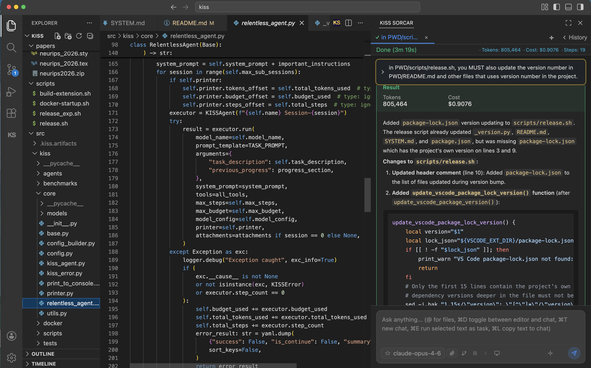

<div align="center">


# When Simplicity Becomes Your Superpower: Meet KISS Sorcar, a General-purpose and Software engineering AI Assistant and IDE

[](https://pypi.org/project/kiss-agent-framework/)
[](LICENSE)
[](https://www.python.org/)

*"Everything should be made as simple as possible, but not simpler." — Albert Einstein*

</div>

______________________________________________________________________

KISS stands for ["Keep it Simple, Stupid"](https://en.wikipedia.org/wiki/KISS_principle) which is a well-known software engineering principle.

<details>
<summary><strong>Table of Contents</strong></summary>

- [Introduction to KISS Sorcar](#introduction-to-kiss-sorcar)
- [Full Installation](#full-installation)
- [KISS Sorcar Extension Installation](#kiss-sorcar-extension-installation)
- [CLI Interface](#cli-interface)
- [Models Supported](#-models-supported)
- [Contributing](#-contributing)
- [License](#-license)
- [Authors](#%EF%B8%8F-authors)

</details>

# Introduction to KISS Sorcar


**KISS Sorcar** (named after [P.C. Sorcar, the legendary Bengali magician](https://en.wikipedia.org/wiki/P._C._Sorcar), evoking the idea of an agent that performs feats that appear magical yet are grounded in disciplined engineering) is a **general-purpose assistant** and **integrated development environment** (IDE) built on top of the **KISS Agent Framework**, a stupidly-simple agentic framework. It **codes really well** and **works pretty fast**. The agent can **run relentlessly for hours**. KISS Sorcar is implemented as a **Visual Studio Code extension** that runs **locally**. It has **full browser** support (using open-source Chromium browser and Playwright), **multimodal** support, **Docker container** support, and OpenClaw like features (whose functionality will be posted later in the social media). The good part is that KISS Sorcar is **completely free** and **open-source**; all one needs is a model API key from a major LLM provider, such as Anthropic (highly recommended). A paper on KISS Sorcar can be found at [papers/kisssorcar/kiss_sorcar.pdf](papers/kisssorcar/kiss_sorcar.pdf). The sorcar.db\* files have been released to illustrate how KISS Sorcar was used to write the paper. Copy them to ~/.kiss/ folder (after backing them up), restart vscode, and load an item from the history. You can also load an item after setting the demo mode on.

**KISS Sorcar scored 62.2% on Terminal Bench 2.0, beating both Cursor agent (61.7%) and Claude Code (58%).**

An old video on KISS Sorcar can be found at [https://www.youtube.com/watch?v=xnYxWvRqACE](https://www.youtube.com/watch?v=xnYxWvRqACE). We **no longer** recommend to explicitly create a plan in KISS Sorcar. See the paper for details.

<scriptsize>Note that **Sorcar** also means government in Bengali.</scriptsize>

## Full Installation

```
curl -fsSL https://github.com/ksenxx/kiss_ai/scripts/install.sh | bash
```

## KISS Sorcar Extension Installation

To Install KISS Sorcar, open Visual Studio Code, search for "KISS Sorcar" in the extension marketplace, install, and relaunch VS Code. Press ESC if you don't have a specific API key, but you must provide at least one API key.

You can also manually download the extension from [src/kiss/agents/vscode/kiss-sorcar.vsix](src/kiss/agents/vscode/kiss-sorcar.vsix).

## CLI Interface

If you do not want to use the KISS Sorcar IDE, you can open a terminal and use sorcar as a normal shell command. Some examples are:

```
sorcar -t "What is 2435*234"

sorcar -n -t --use-chat "What is 2435*234?" # to start in a new chat session in sorcar use -n

sorcar -m "claude-sonnet-4-6" -t "What is 2435*234?" # to use a specific model

echo "Can you find the cheapest non-stop flight from SFO to JFK on June 15 by consulting various websites?" > prompt
sorcar -f prompt # use contents of a file to send task

sorcar -t 'Can you send the message "Hello from Sorcar!" to ksen via the desktop slack app?'

sorcar -t 'Can you show me the detailed step-by-step workflow of gepa.py?'
```

## 🤖 Models Supported

**Supported Models**: The framework includes context length, pricing, and capability flags for:

**Generation Models** (text generation with function calling support):

- **OpenAI**: gpt-4.1, gpt-4.1-mini, gpt-4.1-nano, gpt-4o, gpt-4o-mini, gpt-4.5-preview, gpt-4-turbo, gpt-4, gpt-5, gpt-5-mini, gpt-5-nano, gpt-5-pro, gpt-5.1, gpt-5.2, gpt-5.2-pro, gpt-5.3-chat-latest, gpt-5.4, gpt-5.4-mini, gpt-5.4-nano, gpt-5.4-pro, gpt-5.5
- **OpenAI (Codex)**: gpt-5-codex, gpt-5.1-codex, gpt-5.1-codex-max, gpt-5.1-codex-mini, gpt-5.2-codex, gpt-5.3-codex, codex-mini-latest
- **OpenAI (Reasoning)**: o1, o1-mini, o1-pro, o3, o3-mini, o3-mini-high, o3-pro, o3-deep-research, o4-mini, o4-mini-high, o4-mini-deep-research
- **OpenAI (Open Source)**: openai/gpt-oss-20b, openai/gpt-oss-120b
- **Anthropic**: claude-opus-4-7, claude-opus-4-6, claude-opus-4-5, claude-opus-4-1, claude-opus-4, claude-sonnet-4-6, claude-sonnet-4-5, claude-sonnet-4, claude-haiku-4-5
- **Anthropic (Legacy)**: claude-3-5-haiku
- **Gemini**: gemini-2.5-pro, gemini-2.5-flash, gemini-2.5-flash-image, gemini-2.0-flash, gemini-2.0-flash-lite
- **Gemini (preview)**: gemini-3-pro-preview, gemini-3-flash-preview, gemini-3.1-pro-preview, gemini-3.1-flash-lite-preview, gemini-2.5-flash-lite
- **Together AI (Llama)**: Llama-4-Scout/Maverick (with function calling), Llama-3.x series (generation only)
- **Together AI (Qwen)**: Qwen2.5-72B/14B/7B-Instruct, Qwen2.5-VL-72B, Qwen2-VL-72B, Qwen3-235B series, Qwen3-Coder-480B, Qwen3-Coder-Next, Qwen3-Next-80B, Qwen3-VL-32B/8B, Qwen3.5-397B/9B (with function calling)
- **Together AI (DeepSeek)**: DeepSeek-R1, DeepSeek-R1-0528, DeepSeek-R1-Distill-Llama-70B, DeepSeek-V3-0324, DeepSeek-V3.1, DeepSeek-V4-Pro (with function calling)
- **Together AI (Kimi/Moonshot)**: Kimi-K2-Instruct, Kimi-K2-Instruct-0905, Kimi-K2-Thinking, Kimi-K2.5, Kimi-K2.6
- **Together AI (Mistral)**: Ministral-3-14B, Mistral-7B-v0.1/v0.2/v0.3, Mistral-Small-24B, Mixtral-8x7B
- **Together AI (Z.AI)**: GLM-5, GLM-5.1, GLM-4.5-Air, GLM-4.6, GLM-4.7
- **Together AI (MiniMax)**: MiniMax-M2.5, MiniMax-M2.7
- **Together AI (Other)**: Nemotron-Nano-9B, Arcee (trinity-mini), cc (haiku, opus, sonnet), DeepCogito (cogito-v2), google/gemma-2/3n/4, essentialai/rnj-1
- **OpenRouter**: Access to 330+ models from 50+ providers via unified API:
  - OpenAI (gpt-3.5-turbo, gpt-4, gpt-4-turbo, gpt-4.1, gpt-4o variants, gpt-5/5.1/5.2/5.3/5.4/5.5 and codex variants, o1, o3, o3-pro, o4-mini, codex-mini, gpt-oss, gpt-audio)
  - Anthropic (claude-3-haiku, claude-3.5-haiku/sonnet, claude-3.7-sonnet, claude-sonnet-4/4.5/4.6, claude-haiku-4.5, claude-opus-4/4.1/4.5/4.6/4.6-fast/4.7 with 1M context)
  - Google (gemini-2.0-flash, gemini-2.5-flash/pro, gemini-3-flash/pro-preview, gemini-3.1-pro/flash-lite-preview, gemma-2-27b, gemma-3-4b/12b/27b, gemma-3n-e4b, gemma-4-26b/31b)
  - Meta Llama (llama-3-8b/70b, llama-3.1-8b/70b, llama-3.2-1b/3b/11b-vision, llama-3.3-70b, llama-4-maverick/scout, llama-guard-3/4)
  - DeepSeek (deepseek-chat/v3/v3.1/v3.2/v3.2-speciale/v4-flash/v4-pro, deepseek-r1/r1-0528/r1-distill variants)
  - Qwen (qwen-2.5-7b/72b, qwen-turbo/plus/max, qwen3-8b/14b/30b/32b/235b, qwen3-coder/coder-plus/coder-next/coder-flash/coder-30b, qwen3-vl variants, qwq-32b, qwen3-next-80b, qwen3-max/max-thinking, qwen3.5-9b/27b/35b/122b/397b/flash/plus, qwen3.6-27b/35b/flash/max/plus)
  - Amazon Nova (nova-micro/lite/pro, nova-2-lite, nova-premier)
  - Cohere (command-r, command-r-plus, command-a, command-r7b)
  - X.AI Grok (grok-3/3-mini/3-beta/3-mini-beta, grok-4/4-fast, grok-4.1-fast, grok-4.20/4.20-multi-agent, grok-code-fast-1)
  - MiniMax (minimax-01, minimax-m1, minimax-m2/m2.1/m2.5/m2.7/m2-her)
  - ByteDance Seed (seed-1.6, seed-1.6-flash, seed-2.0-lite, seed-2.0-mini)
  - MoonshotAI (kimi-k2, kimi-k2-thinking, kimi-k2.5, kimi-k2.6)
  - Mistral (codestral, devstral/devstral-medium/devstral-small, mistral-large/medium/small, mixtral-8x7b/8x22b, ministral-3b/8b/14b, pixtral, voxtral)
  - NVIDIA (llama-3.1-nemotron-70b, llama-3.3-nemotron-super-49b, nemotron-nano-9b-v2/12b-v2-vl, nemotron-3-nano-30b/super-120b)
  - Z.AI/GLM (glm-5/5-turbo/5.1/5v-turbo, glm-4-32b, glm-4.5/4.5-air/4.5v, glm-4.6/4.6v, glm-4.7/4.7-flash)
  - AllenAI (olmo-3-32b-think, olmo-3.1-32b-instruct)
  - Perplexity (sonar, sonar-pro, sonar-pro-search, sonar-deep-research, sonar-reasoning-pro)
  - NousResearch (hermes-2-pro, hermes-3/4-llama series, hermes-4-70b/405b)
  - Baidu ERNIE (ernie-4.5 series including VL and thinking variants)
  - Xiaomi (mimo-v2-flash/omni/pro, mimo-v2.5/v2.5-pro)
  - Reka AI (reka-edge, reka-flash-3)
  - And 25+ more providers (ai21, aion-labs, alfredpros, alibaba, alpindale, anthracite-org, arcee-ai, bytedance, deepcogito, essentialai, ibm-granite, inception, inflection, kwaipilot, liquid, morph, nex-agi, prime-intellect, relace, sao10k, stepfun, tencent, thedrummer, tngtech, upstage, writer, etc.)

**Embedding Models** (for RAG and semantic search):

- **OpenAI**: text-embedding-3-small, text-embedding-3-large, text-embedding-ada-002
- **Google**: text-embedding-004, gemini-embedding-001, gemini-embedding-2-preview
- **Together AI**: BAAI/bge-base-en-v1.5, intfloat/multilingual-e5-large-instruct

Each model in `MODEL_INFO` includes capability flags:

- `is_function_calling_supported`: Whether the model reliably supports tool/function calling
- `is_generation_supported`: Whether the model supports text generation
- `is_embedding_supported`: Whether the model is an embedding model

## 🤗 Contributing

Contributions in the form of issues are welcome! KISS Sorcar should be able to take care of them.

## 📄 License

Apache-2.0

## ✍️ Authors

- Koushik Sen (ksen@berkeley.edu) | [LinkedIn](https://www.linkedin.com/in/koushik-sen-80b99a/) | [X @koushik77](https://x.com/koushik77)
- Marius Momeu (marius.momeu@berkeley.edu) | [LinkedIn](https://www.linkedin.com/in/mariusmomeu/) | [X @MariusMomeu](https://x.com/MariusMomeu)
- Yogya Mehrotra (ymehrotr@ucsc.edu) | [LinkedIn](https://www.linkedin.com/in/yogyamehrotra/)
